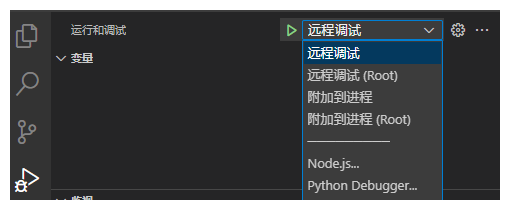
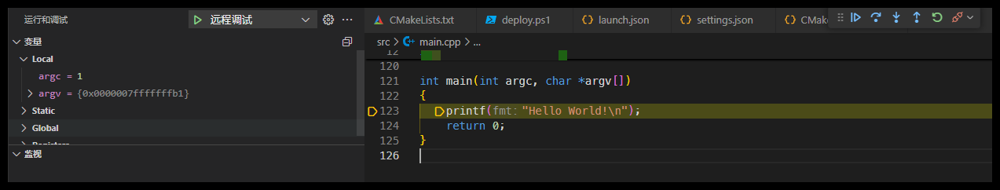

# vscode-android-elf-template
这个仓库包含一套完整的VS Code配置模板，用于Android ELF原生开发和调试，使用CMake构建系统和LLDB调试器。

## 功能特性

- 完整的CMake构建配置
- LLDB远程调试
- 一键部署到Android设备
- 支持普通权限和Root权限调试
- 自动化部署与运行工作流
- Debug和Release编译预设

## 前置要求

1. **Visual Studio Code**
2. **必要的VSCode插件**:
   - [C/C++](https://marketplace.visualstudio.com/items?itemName=ms-vscode.cpptools)
   - [CMake Tools](https://marketplace.visualstudio.com/items?itemName=ms-vscode.cmake-tools)
   - [CodeLLDB](https://marketplace.visualstudio.com/items?itemName=vadimcn.vscode-lldb)

3. **Android SDK和NDK**:
   - Android SDK Platform Tools (adb)
   - Android NDK （当前采用27版本）

4. **在Android设备上**:
   - 必须启用USB调试
   - 对于root功能，设备需要已root

## 快速开始

### 1. 克隆项目

```bash
git clone https://github.com/WangONC/vscode-android-elf-template.git 
cd vscode-android-elf-template
```

### 2. 配置路径
在使用前，您需要修改以下文件中的路径，使其指向您本地的Android SDK和NDK安装位置（查找并替换所有的`<NDK_PATH>`、`<SDK_PATH>`和`<CMAKE_VERSION>`）:

在CMakeLists.txt中:
```cmake
set(ANDROID_NDK_HOME "<NDK_PATH>")
```

在CMakePresets.json中:
```json
"CMAKE_MAKE_PROGRAM": "<SDK_PATH>/cmake/<CMAKE_VERSION>/bin/ninja.exe",
"CMAKE_TOOLCHAIN_FILE": "<NDK_PATH>/build/cmake/android.toolchain.cmake",
```

在c_cpp_properties.json中: 更新所有includePath中的NDK路径

在settings.json中: 更新使用的CMake路径
```json
{
    "cmake.cmakePath": "<SDK_PATH>\\cmake\\<CMAKE_VERSION>\\bin\\cmake.exe"
}
```

### 3. 部署lldb-server
首次使用前，需要将lldb-server部署到设备上:

```bash
adb push <NDK_PATH>/toolchains/llvm/prebuilt/windows-x86_64/lib/clang/18/lib/linux/aarch64/lldb-server /data/local/tmp/
adb shell chmod 755 /data/local/tmp/lldb-server
```

### 4. 构建与调试
1. 选择编译预设:

   - 点击VSCode的CMake栏的，点击更改配置预设
   - 选择"Arm64 Debug"或"Arm64 Release"
   - 或者在`CMakePresets.json`中添加其他预设

2. 选择项目架构:
   - 点击打开cpp源代码文件，VSCode右下角，根据架构选择对应的配置，这主要影响导入特定架构的头文件路径

   > 注意：虽然配置给出了所有的NDK中支持的架构，但是目前项目的编译预设只配置了arm64（虽然添加其他架构的配置也非常的容易）

3. 构建项目:

    - 点击CMake工具栏中生成中的"Build"按钮，或者在命令面板中执行: CMake: Build

4. 部署到设备:

    -在命令面板中执行: `Tasks: Run Task` → 选择 部署。这会构建项目后，通过adb将其部署到设备的/data/local/tmp目录下
5. 调试应用:

    - 从调试面板选择"远程调试"或"远程调试 (Root)"
    - 点击开始调试按钮

6. 直接运行应用:

    - 在命令面板中执行: `Tasks: Run Task` → 选择 `仅运行`或`仅运行 (root)`
  
## 运行效果





## 多设备支持
受到vscode的限制，当前不能很好的支持多设备。所以当连接多个Android设备时，您需要手动指定目标设备。

修改方法如下:

找到`CMakeList.txt`中的`set(DEVICE_SERIAL "")`,将设备序列号填入即可

## 说明
### 调试模式
调试模式使用LLDB连接到设备并允许完整的调试体验(断点、单步调试等)。

> 在首次打开时，可能需要先执行一次构建操作，调试才会有效，这主要是为了让CMake确定生成物的路径

### 运行模式
当前配置中没有直接的"运行"按钮，但有两种方式可以实现类似体验:

  1. 使用Release模式:

      - 选择"Arm64 Release"预设
      - Release模式移除了调试符号，即使使用调试按钮也不会在断点处停止

  2. 使用任务运行:

      - 执行任务: 仅运行 或 仅运行 (root)
      - 这些任务会直接在设备上执行程序而不进入调试模式

## 跨平台
配置创建的时候再大多数场景下都没有考虑跨平台，但是大多数工具本身也就是跨平台的，所以使其支持linux和macOS并不难。

理论上讲，创建目标平台对应的deploy脚本，并针对性的修改对应平台的等效命令即可

## 开发目标

就是一个配置，没啥目标可言了，受到VSCode的限制基本上到头了，也很难变得更好用了。

下一步目标可能就是根据这个直接开发一个插件。。。
